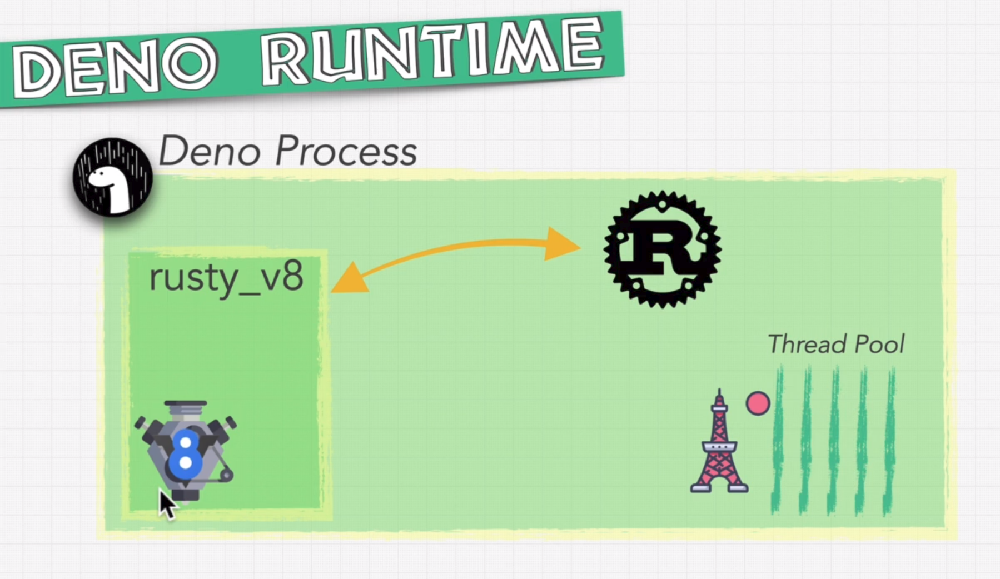

## Deno Foundation


## How it works



V8 write in C++ understand JS code. It's compile down to binary

Tokio for Async

When we run rust code? <br>
Whenever we run `Deno.` or `window.` namespace


Deno has browser compatibility

```js
const food = Deno.args[0]
```

`Deno Javascript and Deno Rust`
```
~/Documents/stee/deno-land/01_Foundations (main) 🐻
$ deno run deno.js 'love'
🦕...Deno is born!
┌─────────────────────────┬────────┐
│ (idx)                   │ Values │
├─────────────────────────┼────────┤
│ opsDispatched           │ 1      │
│ opsDispatchedSync       │ 1      │
│ opsDispatchedAsync      │ 0      │
│ opsDispatchedAsyncUnref │ 0      │
│ opsCompleted            │ 1      │
│ opsCompletedSync        │ 1      │
│ opsCompletedAsync       │ 0      │
│ opsCompletedAsyncUnref  │ 0      │
│ bytesSentControl        │ 0      │
│ bytesSentData           │ 0      │
│ bytesReceived           │ 0      │
└─────────────────────────┴────────┘
```

With one setTimeout, we have once opsDispatchedAsync

```js
setTimeout(() => {
  console.log('check')
}, 1000)

console.table(Deno.metrics())
```

```
┌─────────────────────────┬────────┐
│ (idx)                   │ Values │
├─────────────────────────┼────────┤
│ opsDispatched           │ 3      │
│ opsDispatchedSync       │ 2      │
│ opsDispatchedAsync      │ 1      │
```