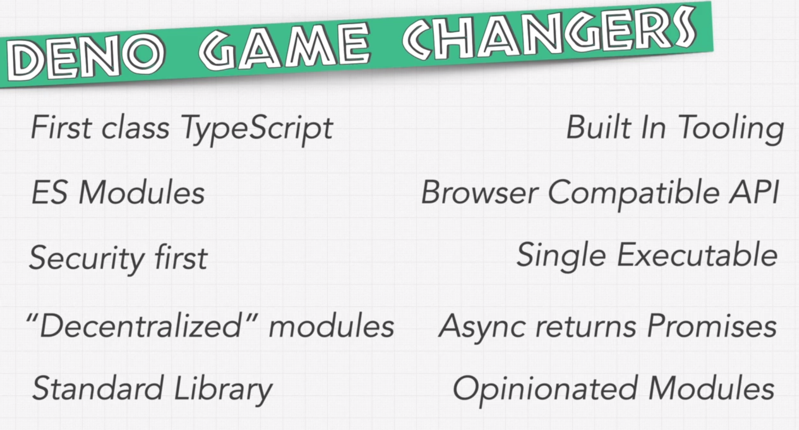

# Deno vs Node



Deno is like website, it works in `sandbox`

`Single Executable To Rule Them All`

ONLY ONE FILE AFTER COMPILE IT'S A GAME CHANGER

```
$ deno run --allow-env main.ts
Hello kuba
```

## Installing

```
$ deno install --allow-env main.ts
✅ Successfully installed deno-something
/home/kuba/.deno/bin/deno-something
```

```
$ deno-something
Hello kuba
```

```
$ deno run -A Drakefile.ts hello
run: started
hello: started
Hello from Drake!
Hello kuba
hello: finished (41ms)
run: finished (43ms)
```