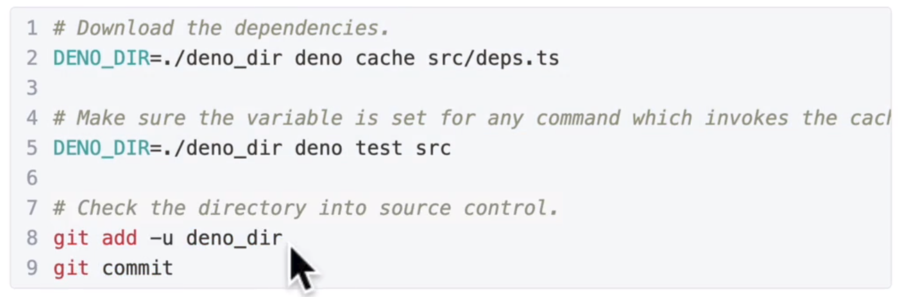
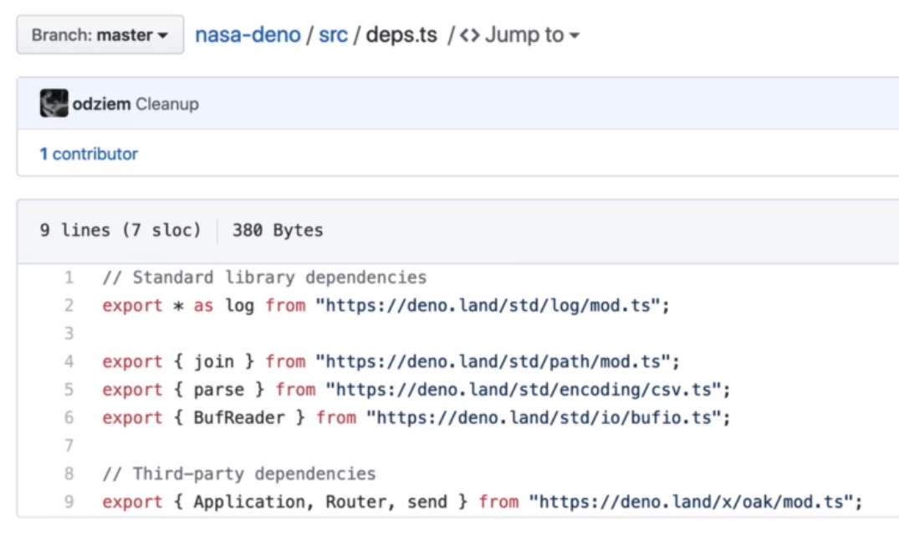
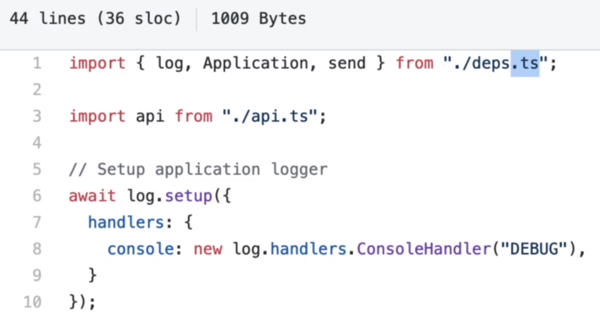
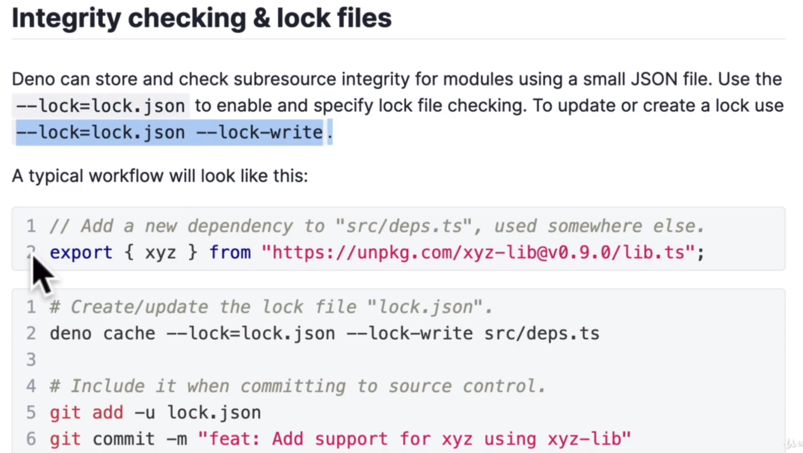
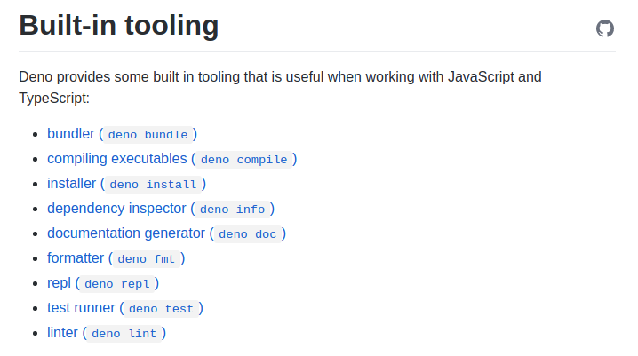
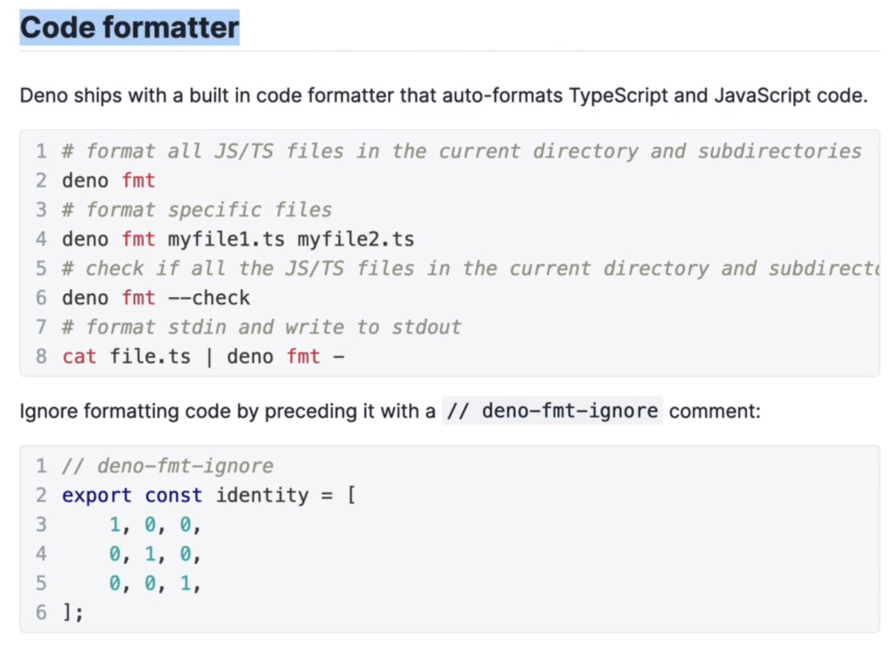

# Deno modules

```
$ deno info './deno.js'
local: /home/kuba/Documents/stee/deno-land/03_DenoModules/deno.js
type: JavaScript
dependencies: 1 unique (total 201B)

file:///home/kuba/Documents/stee/deno-land/03_DenoModules/deno.js (65B)
└── file:///home/kuba/Documents/stee/deno-land/03_DenoModules/deno2.js (136B)
```

`URL import`

```js
import "https://deno.land/std@0.103.0/examples/welcome.ts"
```

```
$ deno run deno.js     
Download https://deno.land/std@0.103.0/examples/welcome.ts
Check file:///home/kuba/Documents/stee/deno-land/03_DenoModules/deno.js
Welcome to Deno!
DENO
```

Deno has a `sandbox` and this is very secure

Deno require to use `file extensions`

## Caching in deno

```
$HOME/.cache/deno
```

## Change $DENO_DIR directory



# [Skypack CDN](https://www.skypack.dev/)

## Best practice to use dependencies





## Use locked deps like package-lock.json



```
touch lock.json
deno chache --look=lock.json --lock-write src/deps.ts
```

## Upgrade deno by

```
deno upgrade
```

## Entry file of the app
`mod.ts` is a rust convention and `main` file

## Deno is entire system



## Deno formatter

