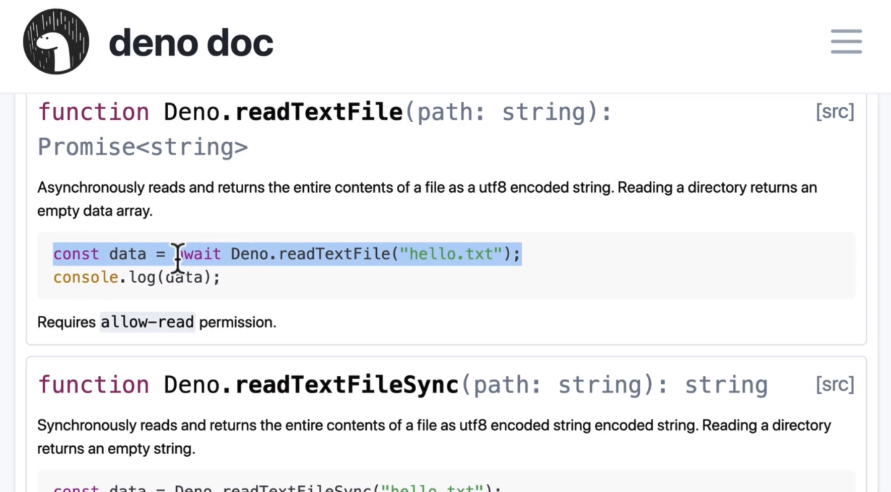

# Deno Files



In `Sync` Deno wait for this operation and in `Async` can make others things

```ts
async function readFile() {
  const data = await Deno.readTextFile("heeello.txt")

  console.log(data)
}

await readFile() // top level await
```

```
$ deno run --allow-read mod.js
heeello world!
```